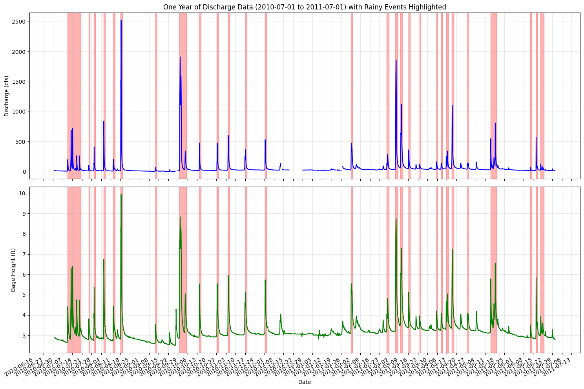
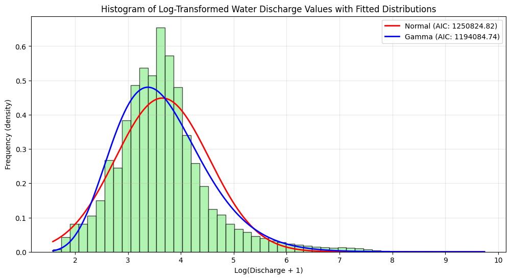
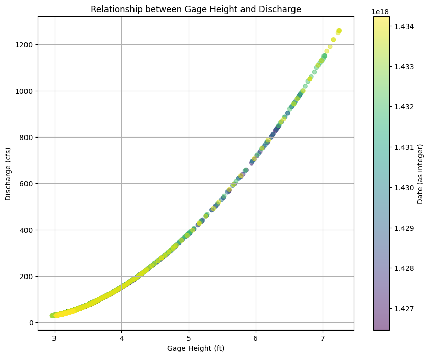
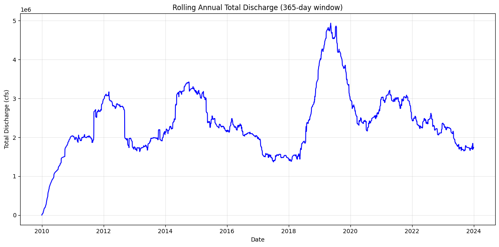
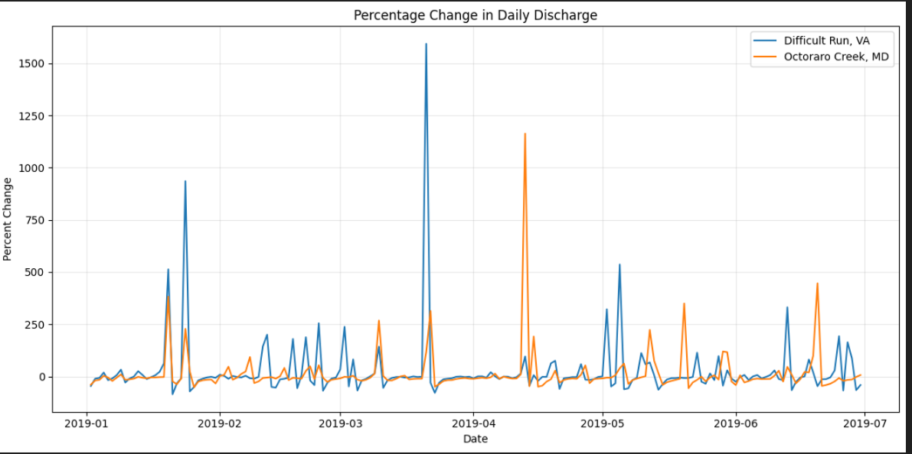

# Water-Level Time-Series (Difficult Run, VA)

Clean, reproducible time-series analysis of river discharge & gage height.  
Includes an interactive HTML report, a tiny sample dataset, and key plots for fast skim.

**What’s inside**
- `docs/index.html` – full report (enable GitHub Pages → main /docs to view online)
- `data/sample/difficult_run_10yr_data.csv` – 5-day slice for demos
- `results/figures/` – showcase figures (below)
- `notebooks/` – original analysis notebook
- `env/requirements.txt` – minimal deps

**Results (figures)**
-   
  *One-year discharge with detected storm “event” windows highlighted.*
-   
  *Log(discharge+1) with Normal vs Gamma fits (AICs in legend).*
-   
  *Non-linear rating curve: gage height vs discharge.*
-   
  *Rolling 365-day total discharge (long-term variability).*
-   
  *Daily %-change spikes over a six-month window.*